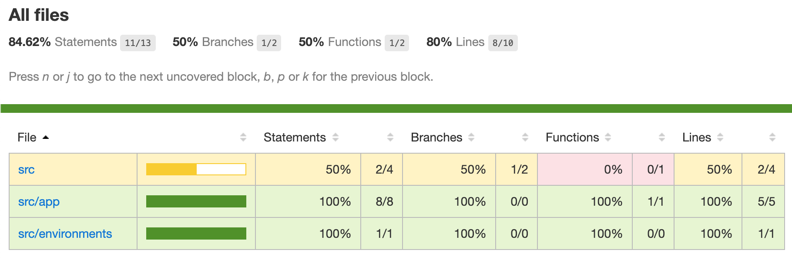

# Cypress-Angular-Coverage-Example

This project was generated with [Angular CLI](https://github.com/angular/angular-cli) version 8.1.1.

## Forked from [skylock/cypress-angular-coverage-example](https://github.com/skylock/cypress-angular-coverage-example)

Read the [original instructions](SETUP.md) how to add Cypress to Angular project. This will get you Cypress AND instrumented source files when you start the application.

After that add [@cypress/code-coverage](https://github.com/cypress-io/code-coverage#install)

You should have code coverage report generated in `coverage` folder after each test run

```
open coverage/lcov-report/index.html
```


